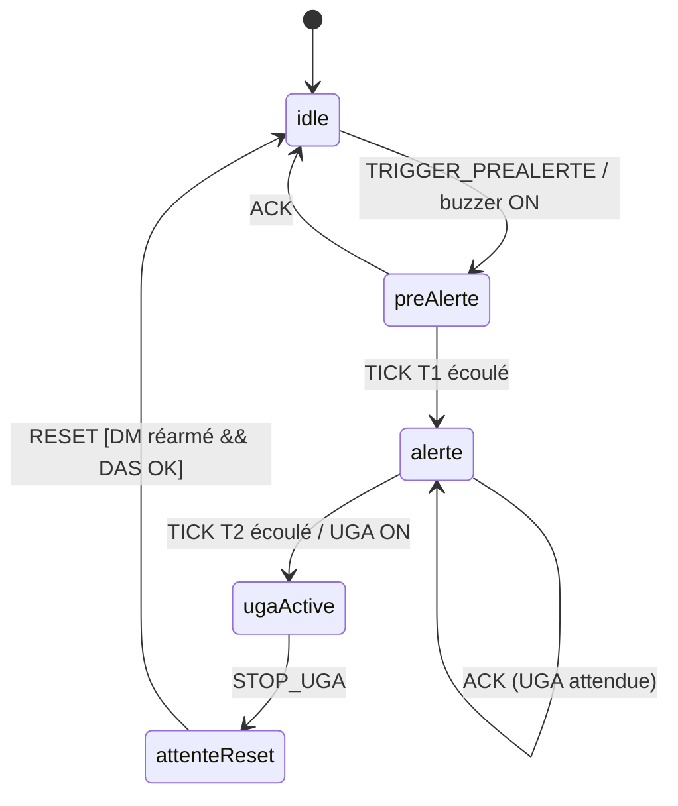

# Simulateur SSI Catégorie A

Ce monorepo fournit un simulateur pédagogique complet pour la formation à l'exploitation d'un Système de Sécurité Incendie (SSI) de catégorie A. Il comprend trois applications :

- **Poste Apprenant** (`apps/trainee-station`) : reproduction de la façade CMSI, des périphériques SDI et des commandes UGA/DAS.
- **Central SSI virtuel** (`apps/central-panel`) : façade CMSI fidèle (LCD 4×20, voyants, clavier, chronos T1/T2, buzzer WebAudio) exposée en plein écran ou iframe.
- **Console Formateur** (`apps/trainer-console`) : supervision en temps réel, injection d'événements et scoring.
- **Serveur** (`apps/server`) : API Express, WebSocket temps réel et base de données SQLite via Prisma.

La structure suit les sous-systèmes du synoptique SSI cat. A :

- **SDI (Système de Détection Incendie)** : détecteurs automatiques, déclencheurs manuels, dérangements.
- **CMSI (Centralisateur de Mise en Sécurité Incendie)** : temporisations T1/T2, commandes d'asservissement et signalisations.
- **DAS (Dispositifs Actionnés de Sécurité)** : compartimentage, désenfumage, ventilation et retours de position.
- **UGA / ECS** : diffusion sonore et messages vocaux avec gestion des asservissements.
- **Alimentations** : bascule secteur / batterie, supervision de tension.
- **Zones de Détection (ZD) / Zones de Mise en Sécurité (ZF)** : correspondances et états simulés.

## Installation

```bash
npm install
npm run prisma:deploy # voir section serveur pour la configuration Prisma
```

## Démarrage

```bash
npm run dev
```

Cette commande lance simultanément :

- le serveur Express + WebSocket (port 4500),
- l'interface Apprenant (port 5300),
- la façade Central SSI (port 5400, intégrable en iframe),
- l'interface Formateur (port 5301).

Les composants critiques reposent sur des machines XState synchronisées via WebSocket (latence cible < 100 ms sur LAN) :



Raccourcis clavier par défaut :

| Touche | Action |
| --- | --- |
| `A` | Acquitter |
| `G` | Évacuation générale |
| `S` | Arrêt évacuation |
| `R` | Réarmement (si conditions réunies) |
| `B` | Silence buzzer |
| `J` | Ouvrir / fermer le journal complet |
| `M` | Masquer / réafficher ZD1 |
| `K` | Tourner la clef (Utilisateur ↔ Auteur) |

## Documentation

La documentation détaillée se trouve dans le dossier `docs/` :

- `docs/manual-apprenant.pdf` : parcours guidé pour le stagiaire.
- `docs/manual-formateur.pdf` : pilotage des scénarios et grille de notation.
- `docs/state-diagrams.md` : machines d'état (Mermaid) couvrant CMSI, DAS et alimentation.
- `docs/db-schema.md` : description des tables Prisma.
- `docs/lancement-interfaces.md` : procédures détaillées pour démarrer les interfaces.
- `docs/RECETTE.md` : plan de test terrain (10 cas orientés CMSI + replay/export PDF).
- `docs/PEDAGOGIE.md` : déroulé pédagogique type et critères d'évaluation.

## Tests

Chaque application embarque des suites Jest + React Testing Library pour valider les composants et les machines d'état critiques.

## Licence

Projet éducatif. Redistribution et modifications autorisées avec mention de la source.
