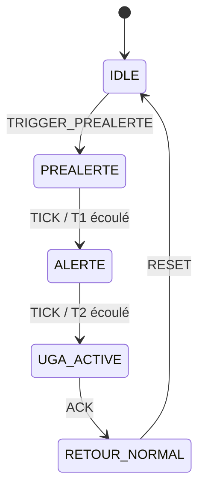
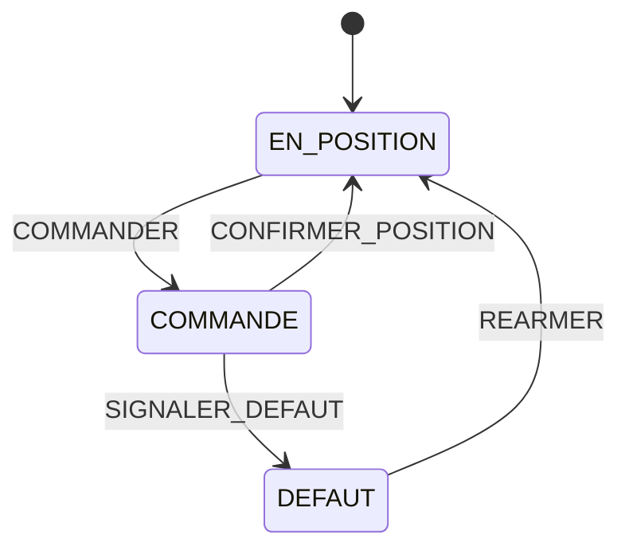
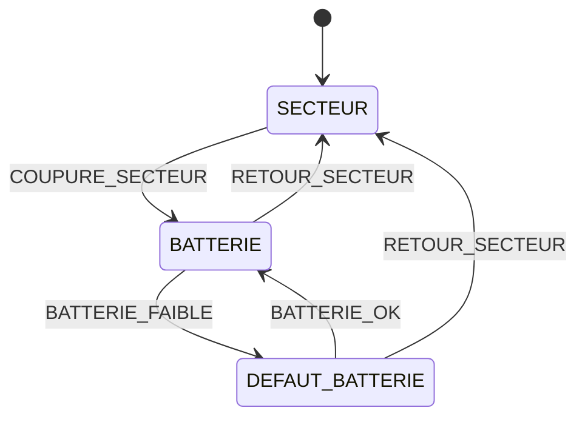

# Diagrammes d'état

## CMSI

```mermaid
stateDiagram-v2
    [*] --> IDLE
    IDLE --> PREALERTE: TRIGGER_PREALERTE
    PREALERTE --> ALERTE: TICK / T1 écoulé
    ALERTE --> UGA_ACTIVE: TICK / T2 écoulé
    UGA_ACTIVE --> RETOUR_NORMAL: ACK
    RETOUR_NORMAL --> IDLE: RESET
```

## DAS

```mermaid
stateDiagram-v2
    [*] --> EN_POSITION
    EN_POSITION --> COMMANDE: COMMANDER
    COMMANDE --> EN_POSITION: CONFIRMER_POSITION
    COMMANDE --> DEFAUT: SIGNALER_DEFAUT
    DEFAUT --> EN_POSITION: REARMER
```

## Alimentation

```mermaid
stateDiagram-v2
    [*] --> SECTEUR
    SECTEUR --> BATTERIE: COUPURE_SECTEUR
    BATTERIE --> SECTEUR: RETOUR_SECTEUR
    BATTERIE --> DEFAUT_BATTERIE: BATTERIE_FAIBLE
    DEFAUT_BATTERIE --> BATTERIE: BATTERIE_OK
    DEFAUT_BATTERIE --> SECTEUR: RETOUR_SECTEUR
```
