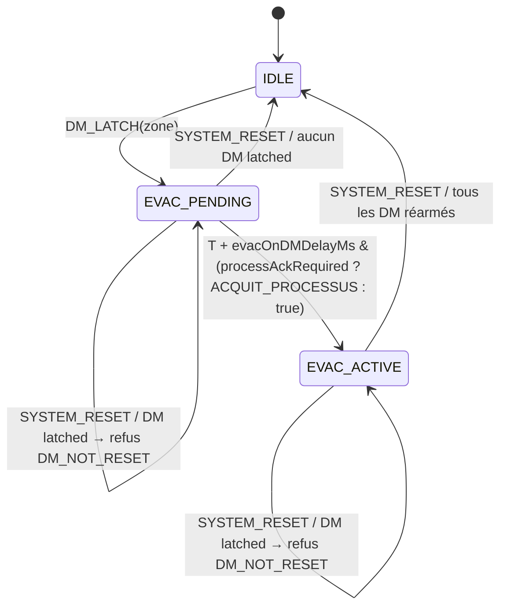
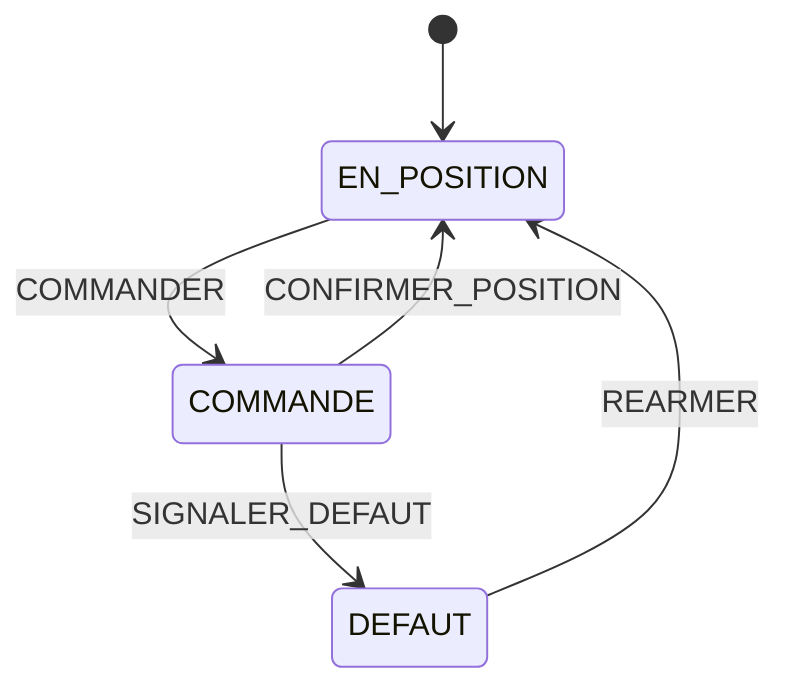
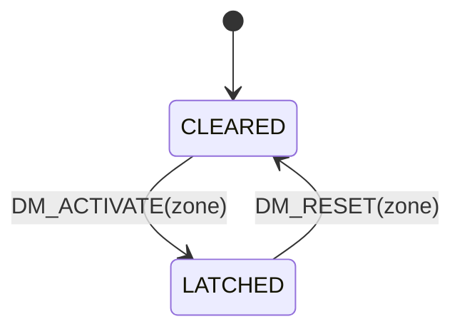
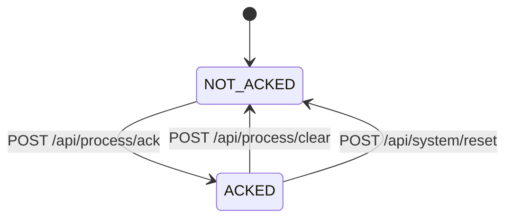
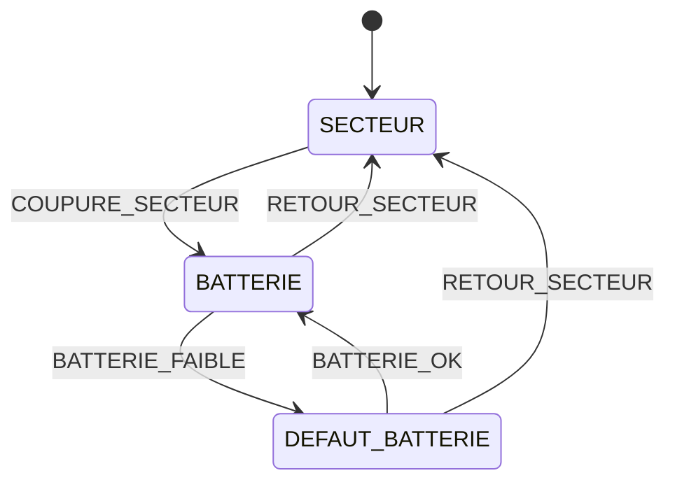

# Diagrammes d'état

## CMSI

```mermaid
stateDiagram-v2
    [*] --> IDLE
    IDLE --> EVAC_PENDING: DM_LATCH(zone)
    EVAC_PENDING --> EVAC_ACTIVE: T + evacOnDMDelayMs & (processAckRequired ? ACQUIT_PROCESSUS : true)
    EVAC_PENDING --> IDLE: SYSTEM_RESET / aucun DM latched
    EVAC_ACTIVE --> IDLE: SYSTEM_RESET / tous les DM réarmés
    EVAC_PENDING --> EVAC_PENDING: SYSTEM_RESET / DM latched → refus DM_NOT_RESET
    EVAC_ACTIVE --> EVAC_ACTIVE: SYSTEM_RESET / DM latched → refus DM_NOT_RESET
```

## DAS

```mermaid
stateDiagram-v2
    [*] --> EN_POSITION
    EN_POSITION --> COMMANDE: COMMANDER
    COMMANDE --> EN_POSITION: CONFIRMER_POSITION
    COMMANDE --> DEFAUT: SIGNALER_DEFAUT
    DEFAUT --> EN_POSITION: REARMER
```

## Déclencheur Manuel (DM)

```mermaid
stateDiagram-v2
    [*] --> CLEARED
    CLEARED --> LATCHED: DM_ACTIVATE(zone)
    LATCHED --> CLEARED: DM_RESET(zone)
```

## Acquit Processus

```mermaid
stateDiagram-v2
    [*] --> NOT_ACKED
    NOT_ACKED --> ACKED: POST /api/process/ack
    ACKED --> NOT_ACKED: POST /api/process/clear
    ACKED --> NOT_ACKED: POST /api/system/reset
```

## Alimentation

```mermaid
stateDiagram-v2
    [*] --> SECTEUR
    SECTEUR --> BATTERIE: COUPURE_SECTEUR
    BATTERIE --> SECTEUR: RETOUR_SECTEUR
    BATTERIE --> DEFAUT_BATTERIE: BATTERIE_FAIBLE
    DEFAUT_BATTERIE --> BATTERIE: BATTERIE_OK
    DEFAUT_BATTERIE --> SECTEUR: RETOUR_SECTEUR
```
